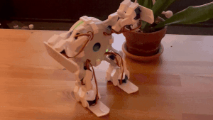

# Make robot walk in humanoid form

**Description**: 
* **Deliverables**: Write a script or program
* **Visible outcome**: Control the robot to walk in humanoid form
* **Techstacks**: Using the provided functions of the `Crawler()` class to manipulate correct motors in correct trajectories
* **Constraints**: N/A

    

