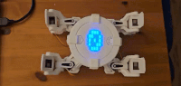

# IMU counter for CYOCrawler

**Description**: 
* **Deliverables**: Write a function
* **Visible outcome**: Display a number that counts how many times the robot is shaken left or right
* **Techstacks**: Using IMU sensor to detect shakes, LED matrix to display number
* **Constraints**: N/A

    

