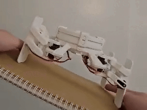

# Simple IMU gimbal to stabilize robot

**Description**: 
* **Deliverables**: Write a function
* **Visible outcome**: To balance the robot's angles on an angle-varying platform
* **Techstacks**: Using IMU sensor to read angle rate and linear acceleration to determine the offset angle and write the offset value to robot's joints
* **Constraints**: N/A

    

