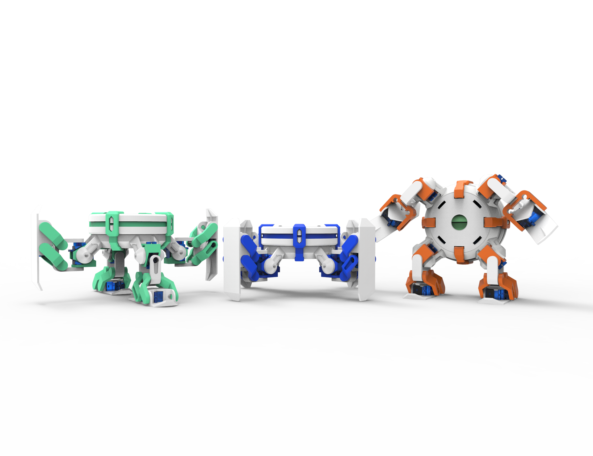

# Introduction
This is the official repository of CYOBOT LLC CYOCrawler, an open-source quadrupedal robotic platform. CYOCrawler comes equipped with enough capabilities for you to get started with your robotic journey seemlessly:
- ESP32 Wi-Fi & Bluetooth MCU
- PCA9685 providing 12-channel servo controller
- LSM6D IMU
- Onboard speaker with MAX98357
- Onboard microphone with MAX9814
- 33-NeoPixel-LED matrix and 12-NeoPixel-LED ring
- Micro SD card reader
- USC C battery charger and smart charging/discharging system
- Extension block with power, I2C, SPI, UART, GPIO

More examples, tutorials and projects using CYOCrawler/CYOBrain can be found on [CYOBot's project library](https://cyobot.projectcocoon.org/).