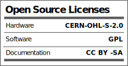

# Introduction
This is the official repository of CYOBOT LLC **CYOCrawler, an open-source quadrupedal robotic platform**. 

CYOCrawler is the ultimate toolkit for beginner to advanced robotic adventures. The robot comes equipped with enough peripherals for most robotic applications, and extension block to connect further devices if needed. CYOCrawler comes with its own coding interface embedded, allowing seamless onboarding process for beginner, with more than enough project activities to learn and play. It is also open-source, welcoming advanced players to creatively level it up.

CYOCrawler is equipped with a wide range of capabilities to accompany you on your robotic journey:
- ESP32 Wi-Fi & Bluetooth MCU
- PCA9685 providing 12-channel servo controller
- LSM6D IMU
- Onboard speaker with MAX98357
- Onboard microphone with MAX9814
- 33-NeoPixel-LED matrix and 12-NeoPixel-LED ring
- Micro SD card reader
- USC C battery charger and smart charging/discharging system
- Extension block with power, I2C, SPI, UART, GPIO

<!-- More examples, tutorials and projects using CYOCrawler/CYOBrain can be found through [CYOBot's project library](https://cyobot.projectcocoon.org/) -->

More examples, tutorials and projects using CYOCrawler/CYOBrain can be found through [CYOBot's project library](https://cyobot.notion.site/a845040ff7484627a544b4d025d32f9d?v=201e9cd408014c6cad27ed2f8226b786&pvs=4)

Every week we publish a new challenge to our community at [r/CYOBot](https://www.reddit.com/r/CYOBot/). Join our Reddit community to participate in challenges and earn yourself a contribution on this repo. Refer to [Challenge](/challenges/readme.md) for more information.

# Technical Specification

# License
This product is open-source certified by OSHWA ([US002433](https://certification.oshwa.org/us002433.html)).

 

# Community
Follow us on social media and join the community!

&nbsp;&nbsp;
&nbsp;&nbsp;
&nbsp;&nbsp;